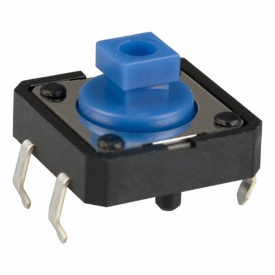
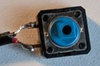
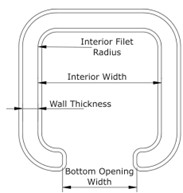
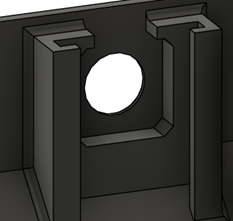
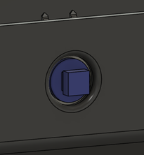
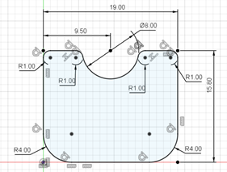
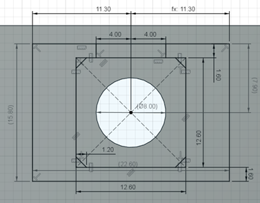
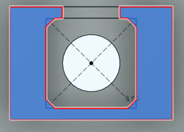
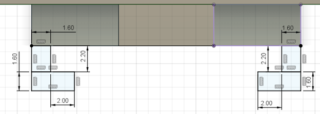
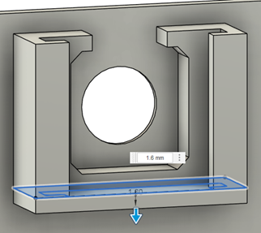

# #4 Sheet Metal Screw

This is the most common switch used at MMC and is found in most of our assistive switches, as well as several devices with integrated buttons.

The tactile switch can be mounted in three different ways, the base mount, the panel mount, and the PCB mount. The PCB mount is done in the PCB design software, and is typically a standard footprint, and is beyond the scope of this report. The base mount is how it is mounted in the assistive switches, while the panel mount is how it was used in the Open Playback Recorder before it was redesigned to use a PCB.

## Purchasing

 | **Tactile Switches can be found at these links:** |        |
| :--------------------- | -----: | 
| Digikey     | [12 mm Tactile Switch DigiKey Link](https://www.digikey.ca/en/products/detail/omron-electronics-inc-emc-div/B3F-5050/368377)|
| Mouser | [12 mm Tactile Switch Mouser Link](https://www.mouser.ca/ProductDetail/Omron-Electronics/B3F-5050?qs=dOLq8QE0Pqqk%2FO9x2OpTQw%3D%3D) |

## Base Mount

The base mount switch is currently mounted with an extruded rim around the switch, and a dab of hot glue in the extrusion to hold the switch in place. A better way of mounting it is being searched for, and this section will be updated once it is found. For the switch to fit in this profile, two of the legs on one side, as well as the protrusions on the bottom must be trimmed off. Some devices, like the [Solderless Unibody Switch](https://github.com/makersmakingchange/Solderless-Unibody-Switch/tree/main), keep these second set of legs on and tuck them under a plastic ridge.

For this part, there are several primary dimensions. The primary dimensions are:

- **Interior Width:** The width of the square that forms the majority of the rim.
- **Wall Thickness:** The thickness of the walls of the rim.
- **Bottom Opening Width:** The width of the opening on the rim for the switch leads and cable to pass through.
- **Maximum Height:** The maximum height that the rim can be extruded before it gets taller than the switch and interferes with the operation of the switch.
- **Interior Filet Radius:** The maximum radius that can be put on the interior of the square that holds the switch. The radius for the exterior is equal to the interior filet radius plus the wall thickness

| Tactile Switch Base Mount Measurements |     |
| :--------------------- | -----: | 
| Interior Width | 13 mm |
| Wall Thickness | 1.6 mm |
| Bottom Opening Width | 8 mm |
| Maximum Height | 3.5 mm |
| Maximum Interior Filet Radius | 1.6 mm |

### Panel Mount

The panel mount method allows a device to mount a button on the device wall. The button typically has a topper of some sort glued onto it, as found on the [Raindrop Switch](https://github.com/makersmakingchange/Raindrop-Switch) or earlier versions of the [Open Playback Recorder](https://github.com/makersmakingchange/Open-Playback-Recorder).

This mount consists of two separate parts, one far more complicated than the other. The first part is the actual wall of the enclosure with the slot for the button. The button is trimmed like it is in the base mount, with 2 legs and the bottom protrusions removed, then it is pressed into the slot in the wall, with the button itself passing through the hole in the wall. Once the button is in place, the retaining panel is slid into the slot behind it to keep it from coming out, and the pressure of the button holds the panel in place.

The panel is a rectangle 19x15.8 mm in size, with an 8 mm diameter half circle cut out of the middle of the edge of one of the 19 mm sides, with the corners on the other side being rounded with a 4 mm filet. All other corners are rounded with a 1 mm fillet. The profile is extruded to 1.6 mm thickness, and a 0.4 mm chamfer is applied to the edges.

The panel mount section is made in several steps. Starting with the enclosure wall, create an 8 mm diameter hole, and apply a 1 mm radius filet to the outside to smooth the edges. On the inside surface of the wall, create a 12.6 mm square centered on the hole, with a 1.2 mm chamfer on the corners. Around this square, create a rectangle 22.6 mm wide, and 15.8 mm tall. The rectangle should be centered horizontally, and the top of the rectangle should be 7.9 mm from the center of the circle. It can optionally extend further down past the 15.8 mm mark, down to the bottom of the enclosure if desired, but 21 mm is the minimum to work with the panel created above. Finally, add another rectangle between the top of the center square and the outer rectangle, centered horizontally, and 8 mm wide. Extrude the selected sections 3.5 mm from the enclosure wall.

After extruding the base, create a sketch on the top face. This sketch will consist of four rectangles, with two on each side, mirrored across the center of the circle. For each side, one rectangle will start at the corner and go 1.6 mm towards the center, then 2.2 mm out away from the base. The second rectangle will start at the outer corner of the first rectangle, and extend 1.6 mm out, and 3.6 mm towards the center. Extrude these two sides down to the bottom of the base.

Finally, at the bottom of the base create a sketch that covers the entire rail and base area (22.6 mm x 7.3 mm) and extrude it down 1.6 mm to cap off the bottom of the rail section. From here, it can be extended to the bottom of the enclosure, or the bottom can be chamfered for printability as normal.

