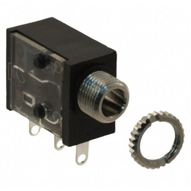
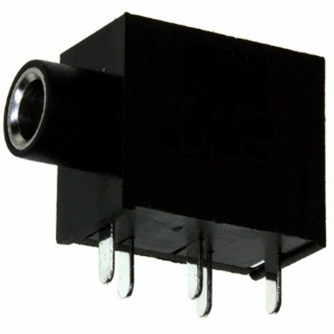

## 3.5 mm Audio Jack

3.5 mm audio jacks are used to allow assistive switches to connect to a device and provide input. There are two different styles of jack commonly used in MMC projects, the PCB mount jack and the panel mount jack. Some projects alternatively use a low mount PCB jack, but the considerations would be the same as the regular PCB mount

For this part, there are several primary dimensions, as well as some design considerations. The primary dimensions are:

- **Panel Mount Passthrough:** The diameter of the hole in the wall of the device to allow the panel mount jack to pass through to the outside of the device. This can also be done using a ¼ inch drill bit.
- **PCB Passthrough:** The diameter of the hole in the wall of the device to allow the PCB mount jack to pass through to the outside of the device.
- **Minimum Cable Spacing:** The diameter of a circle centered on the jack on the outside of the wall that should be kept clear of any other features, including other jacks. This allows enough spacing for any 3.5mm audio cables to plug into the jack without interfering with them. These circles should not overlap, meaning the minimum distance between any two jacks should be equal to this spacing.
- **Maximum Wall Thickness:** The maximum thickness of a wall for the panel mount jack. This is the thickest a wall can be and still allow enough of the threaded part of the jack to stick through for the nut to thread onto and secure the jack.

| 3.5 mm Jack Measurements |     |
| :--------------------- | -----: | 
| Panel Mount Passthrough | 6 mm |
| PCB Passthrough | 7 mm |
| Minimum Cable Spacing | 12 mm |
| Maximum Wall Thickness | 2.4 mm |

When designing parts that use this component, you need to keep in mind the following design considerations

- **Horizontally printed holes:** Holes in the wall of a print can sag when printed, while this isn't an issue for the threaded part of the hole, this can cause the passthrough hole to not pass through wall. When designing a hole meant to print horizontally, use a circumscribed octagon instead to eliminate the steep overhangs at the top of the circle.

## Purchasing

 | **3.5 mm Audio Jacks can be found at these links:** |        |
| :--------------------- | -----: | 
| Panel Mount Digikey     | [Panel Mount Jack DigiKey Link](https://www.digikey.ca/en/products/detail/switchcraft-inc/35RAPC2AV/772080)|
| Panel Mount Mouser | [Panel Mount Jack Mouser Link](https://www.mouser.ca/ProductDetail/Switchcraft/35RAPC2AV?qs=I3kMT7EEIOWP5G1fR6CxcA%3D%3D) |
| PCB Mount Digikey     | [PCB Mount Jack DigiKey Link](https://www.digikey.ca/en/products/detail/same-sky-formerly-cui-devices/SJ1-3535NG/738699)|
| PCB Mount Mouser | [PCB Mount Jack Mouser Link](https://www.mouser.ca/ProductDetail/Same-Sky/SJ1-3535NG?qs=WyjlAZoYn50jUmKVsqeRJw%3D%3D)|