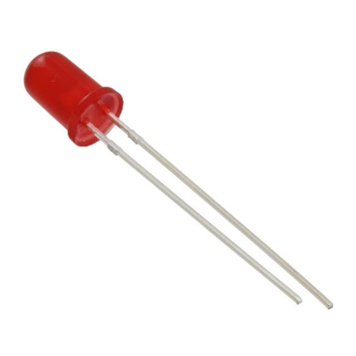
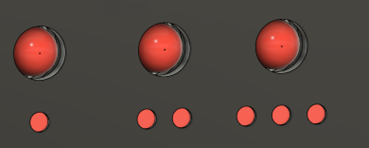
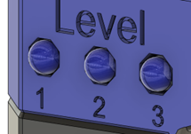
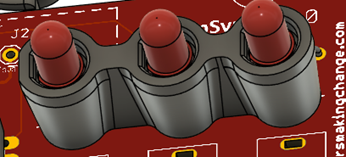
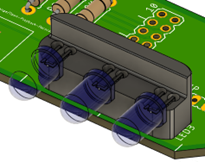

## 5 mm LEDs

5mm LEDs are the most common method of providing visual feedback in MMC devices.

When adding LEDs to a design, the shape of the opening will change depending on if the LED comes out of a surface that is parallel to the print bed or perpendicular to it. If the surface is parallel to the bed, a circular hole can be used, but if the surface is perpendicular to the print bed, a circumscribed octagon should be used to prevent the top of the printed opening from sagging like a circle would.

Spacers have been used in projects such as the [Open Playback Recorder](https://github.com/makersmakingchange/Open-Playback-Recorder) and the [LipSync](https://github.com/makersmakingchange/LipSync) to both hold the LEDs in place while they are soldered and space the LEDs the correct distance from the PCB so that they are flush with the exterior of the device. The spacer in the LipSync has the LED pressed directly against the spacer, facing the same direction as the PCB, while the spacer in the [Open Playback Recorder](https://github.com/makersmakingchange/Open-Playback-Recorder) is a two-tiered, stepped design to allow it to be soldered in place at a certain spacing, then bent 90 degrees to face the side of the device.

When designing a spacer, it is important to add a feature to indicate the orientation of the LED. This is normally done with a flat surface to match the flat surface on the cathode (negative) side of the LED. On some spacers, the LED is recessed with the flat on the spacer so that it can only fit in on the correct orientation.

The following are the key dimensions to use when designing for a 5mm LED.

- **Passthrough Diameter:** The diameter of the hole that the LED passes through. If the hole is in the top of the enclosure or prints parallel to the print bed, make this hole a circle. If the hole is in the side of the enclosure or prints perpendicular to the print bed, make the hole a circumscribed octagon.
- **Leg Diameter:** The diameter of the hole in the spacer for the LED legs to pass through.
- **Leg Spacing:** The leg spacing is the space between the centers of each leg of the LED.

| LED Measurements |     |
| :--------------------- | -----: | 
| Passthrough Diameter | 5.4 mm |
| Leg Diameter | 2 mm |
| Leg Spacing | 2.54 mm (0.1in) |

When designing parts that use this component, you need to keep in mind the following design considerations

- **Overhanging holes**: holes in unsupported overhanging material can print poorly and lead to parts not fitting. Refer to the Hydra Research Design Rules [section on overhanging holes](https://www.hydraresearch3d.com/design-rules#unsupported-holes) for how to design an overhanging hole that can print without support
- **Horizontally printed holes:** Holes in the wall of a print can sag when printed, while this isn't an issue for the threaded part of the hole, this can cause the passthrough hole to not pass through wall. When designing a hole meant to print horizontally, use a circumscribed octagon instead to eliminate the steep overhangs at the top of the circle.

## Purchasing

 | **5 mm LEDs can be found at these links:** |        |
| :--------------------- | -----: | 
| Digikey     | Coming Soon|
| Mouser | Coming Soon|
