## Battery Contact Plates

Battery contact plates are used in devices to eliminate the need for dedicated commercial battery enclosure components and instead integrate the battery enclosure into the device. To do this, three components are used, a contact spring plate, a solid contact place, and a contact bridge plate.

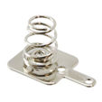
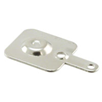
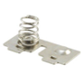

Designed for use with AAA batteries, these plates allow batteries to be integrated into the body of the device like in a TV remote or similar device. So far, these have only been used in the [Musical Grasping Training Aid](https://github.com/makersmakingchange/Musical_Grasping_Training_Aid) in the MMC Library.

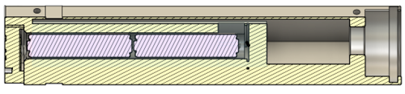

When designing with these, there are a number of considerations for how to mount them into a part, and a number of considerations on how to align and space them. This section will be split into four sections, one on how to mount each of the three contact plates and one on positioning them.

### Contact Spring Plate

The solid contact plate is the battery contact that contacts the negative terminal of the battery stack and is wired into the rest of the device. The plate is retained into the device by a press fit rail.

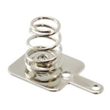

The following are the dimensions used to create the retaining slot for the Contact Bridge Plate. These dimensions are the same as the retaining slot for the Solid Contact Plate.

- **Slot Width:** The width of the slot that the contact plate fits into.
- **Slot Length:** The length of the slot that the contact plate fits into.
- **Sloth Depth:** The distance between the surface of the slot and the retaining rails.
- **Slot Coverage:** The amount of the mounting plate covered by the retaining rails.

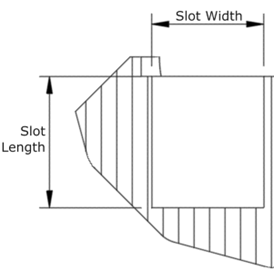
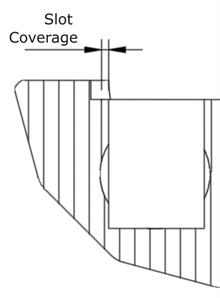

| **Contact Spring Plate Design Dimensions** |     |
| :--------------------- | -----: | 
| **Slot Width** | 11.5 mm |
| **Slot Length** | 13.5 mm |
| **Slot Depth** | 0.75 mm |
| **Slot Coverage** | 0.75 mm |

### Solid Contact Plate

The solid contact plate is the battery contact that contacts the positive terminal of the battery stack and is wired into the rest of the device. The plate is retained into the device by a press fit rail.

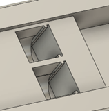
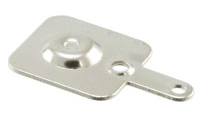

The following are the dimensions used to create the retaining slot for the Solid Contact Plate. These dimensions are the same as the retaining slot for the Contact Spring Plate.

- **Slot Width:** The width of the slot that the contact plate fits into.
- **Slot Length:** The length of the slot that the contact plate fits into.
- **Sloth Depth:** The distance between the surface of the slot and the retaining rails.
- **Slot Coverage:** The amount of the mounting plate covered by the retaining rails.

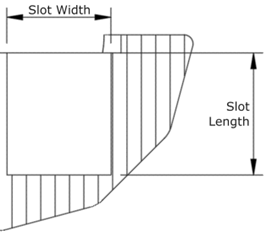
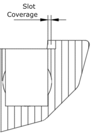

| **Solid Contact Plate Design Dimensions** |     |
| :--------------------- | -----: | 
| **Slot Width** | 11.5 mm |
| **Slot Length** | 13.5 mm |
| **Slot Depth** | 0.75 mm |
| **Slot Coverage** | 0.75 mm |

### Contact Bridge Plate

The Contact Bridge Plate is usually mounted on the section of the battery enclosure that is removable, as it is not wired into the device at all and is just used to bridge the contacts of two parallel batteries. It is press fit into a slot and held in place by the walls of the slot and a retaining bump and divots that fit the bumps on the bridge plate.

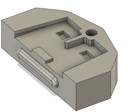

The following are the dimensions used to create the retaining slot for the Contact Bridge Plate.

- **Slot Height:** The height of the main area of the slot.
- **Slot Width:** The width of the main area of the slot.
- **Slot Depth:** The distance between the surface of the retaining slot and the tabs holding the plate in place
- **Slot Wall Coverage:** The maximum amount of the bridge cover that the triangular tabs cover.
- **Retainer Width:** The width of the retaining bump that helps hold the plate in place.
- **Retainer Height:** The height of the retaining bump that helps hold the plate in place.
- **Post Width:** The width of the central post that fits in the slot of the bridge plate.
- **Post Height:** The height of the central post that fits in the slot of the bridge plate.
- **Base Width:** The width of the section at the bottom of the slot that fits between the tabs on the plate.
- **Base Height:** The width of the section at the bottom of the slot that fits between the tabs on the plate.
- **Divot Width:** The width of the divot on the retaining slot that fits the tabs on the plate.
- **Divot Height:** The height of the divot on the retaining slot that fits the tabs on the plate.
- **Divot Depth:** The depth of the divot on the retaining slot that fits the tabs on the plate. This is not on the drawing below, but instead is an extrusion into the sketch plane.
- **Divot Spacing:** The spacing between the inner edge of the retaining divot and the centerline of the retaining slot.
- **Divot Radius:** The radius of the filet on the leading edge of the retaining divot that helps the plate slot into place.

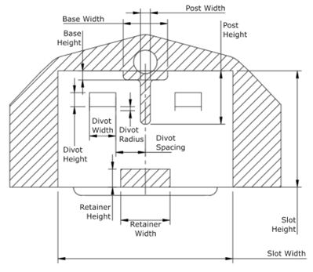
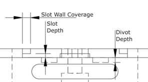

| Contact Bridge Plate Measurements |     |
| :--------------------- | -----: | 
| Slot Height | 14.15 mm |
| Slot Width | 21.3 mm |
| Slot Depth | 0.8 mm |
| Slot Wall Coverage | 1.65 mm |
| Retainer Width | 6 mm |
| Retainer Height | 2.2 mm |
| Post Width | 1.2 mm |
| Post Height | 6.48 mm |
| Base Width | 5.4 mm |
| Base Height | 1.1 mm |
| Divot Width | 3.2 mm |
| Divot Height | 1.7 mm |
| Divot Depth | 1 mm |
| Divot Spacing | 3.6 mm |
| Divot Radius | 0.5 mm |

### Positioning the Contact Plates

For the switch plates to work, they need to be positioned and spaced correctly. The following are a list of dimensions for the positioning and spacing of the contact plates.

- **AAA Battery Tube Diameter:** The diameter of the tube in the device that AAA batteries are inserted in.
- **AAA Battery Length:** The length of a standard AAA battery
- **Plate Spacing:** The amount of space taken up by the contact plates when the device is fully assembled.
- **Battery Spacing:** The spacing between the print surfaces of the retaining slots of the contact bridge plate and the other two contact plates. Equal to the plate spacing plus the battery length for the number of batteries used. Since the batteries are stacked side by side, use the length of half the number of batteries.
- **Plate Height Spacing:** The distance between the center of the battery tube and the bottom of the plate retaining slot.
- **Plate Width Spacing:** The distance between the centers of the two battery tubes.

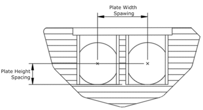

| Contact Plate Positioning Measurements |     |
| :--------------------- | -----: | 
| AAA Battery Tube Diameter | 11.5 mm |
| AAA Battery Length | 44 mm |
| Plate Spacing | 7.4 mm |
| Battery Spacing (4 batteries) | 95.4 mm |
| Plate Height Spacing | 5.7 mm |
| Plate Width Spacing | 13.6 mm |

## Purchasing

 | **Battery Contact Plates can be found at these links:** |        |
| :--------------------- | -----: | 
| Spring Plate Digikey     | [Spring Plate DigiKey Link](https://www.digikey.ca/en/products/detail/keystone-electronics/5201/316365)|
| Spring Plate Mouser | [Spring Plate Mouser Link](https://www.mouser.ca/ProductDetail/Keystone-Electronics/5201?qs=%252BS1bAMbChF%2FxN%2FaZxwnGRQ%3D%3D) |
| Solid Contact Plate Digikey     | [Solid Contact Plate DigiKey Link](https://www.digikey.ca/en/products/detail/keystone-electronics/5223/316374)|
| Solid Contact Plate Mouser | [Solid Contact Plate Mouser Link](https://www.mouser.ca/ProductDetail/Keystone-Electronics/5223?qs=%252BS1bAMbChF%252B3alBpHEy8CA%3D%3D) |
| Contact Bridge Plate Digikey     | [Contact Bridge Plate Digikey Link](https://www.digikey.ca/en/products/detail/keystone-electronics/5213/316372)|
| Contact Bridge Plate Mouser | [Contact Bridge Plate Mouser Link](https://www.mouser.ca/ProductDetail/Keystone-Electronics/5213?qs=U32tdPngY%2FwokHP6mbqrbQ%3D%3D) |
