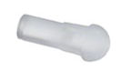
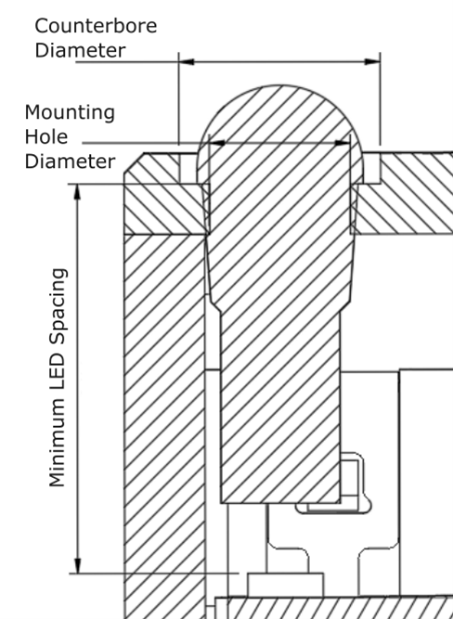

## Light Pipe

Light pipes are used to transmit light from the LEDs on a microcontroller or other internal light sources to the exterior of the enclosure. They are used in devices such as the [LipSync](https://github.com/makersmakingchange/LipSync), the [Ivy Joystick](https://github.com/makersmakingchange/Ivy-Nunchuck-Joystick-Adapter), and the [Willow](https://github.com/makersmakingchange/Willow-Joystick).

When designing for a light pipe, there are two things to consider: the shape of the opening that the light pipe sits in, and the length of the light pipe itself.

- **Mounting Hole Diameter:** The diameter of the hole that the light pipe passes through. This is a press fit and is slightly smaller than the diameter of the light pipe.
- **Counterbore Diameter:** The diameter of the counterbore hole that sinks the head of the light pipe into the surface of the device.
- **Minimum LED Spacing:** The minimum distance between the bottom of the domed section of the light pipe and the LED on the device. If the distance between the LED and the resting surface is less than this, the light pipe will not seat properly in place and can fall out of place. If it is impossible to position the light pipe more than this distance away, the light pipe itself can be trimmed, but this is not recommended.

| Light Pipe Measurements |     |
| :--------------------- | -----: | 
| Mounting Hole Diameter | 2.8 mm |
| Counterbore Diameter | 4 mm |
| Minimum LED Spacing | 6.6 mm |

When designing parts that use this component, you need to keep in mind the following design considerations

- **Overhanging holes**: holes in unsupported overhanging material can print poorly and lead to parts not fitting. Refer to the Hydra Research Design Rules [section on overhanging holes](https://www.hydraresearch3d.com/design-rules#unsupported-holes) for how to design an overhanging hole that can print without support
- **Horizontally printed holes:** Holes in the wall of a print can sag when printed, while this isn't an issue for the threaded part of the hole, this can cause the passthrough hole to not pass through wall. When designing a hole meant to print horizontally, use a circumscribed octagon instead to eliminate the steep overhangs at the top of the circle.

## Purchasing

 | **Light Pipes can be found at these links:** |        |
| :--------------------- | -----: | 
| Digikey     | [Light Pipe DigiKey Link](https://www.digikey.ca/en/products/detail/dialight/51513030250F/4965201) |
| Mouser | [Light Pipe Mouser Link](https://www.mouser.ca/ProductDetail/Dialight/515-1303-0250F?qs=rkevp0fsrts4dv75K85%2FWA%3D%3D)  |
