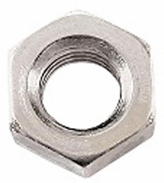
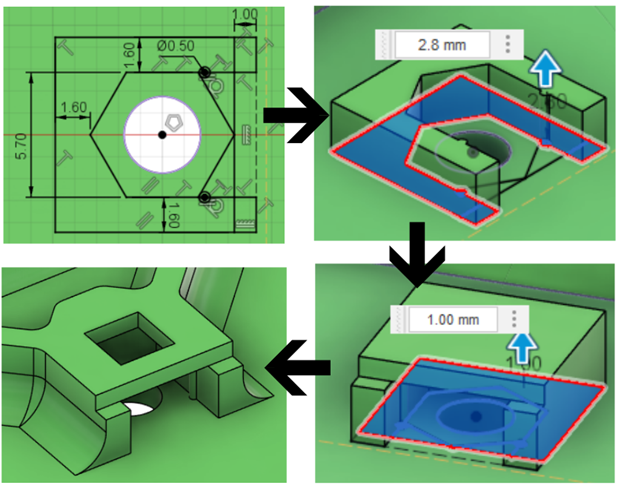

## M3 Nut

M3 nuts are used to add threads to a project, typically in a pair to allow for the attachment of a mounting adaptor like the RAM B adaptor or the ¼-20 Camera mount adaptor.

There is one sketch profile used to make the retaining slot, with two extrudes required. The dimensions used in the sketch and extrusions are listed in the table below, along with a photo of the sketch, the first extrusion, the second extrusion, and the finished retainer after chamfers, filets, and other features are applied. For advice on chamfers and filets, see the [Hydra Research Design Rules](https://www.hydraresearch3d.com/design-rules) guide. The primary dimensions are:

- **Minimum Wall Thickness:** The minimum thickness of the walls of the nut capture.
- **Retaining Bump Diameter:** The diameter of the circular bumps used to retain the nut in the capture.
- **Inset Distance:** The distance from the retaining bump to the beginning of the nut capture walls.
- **Nut Width:** The distance between the two walls of the nut capture.
- **First Extrude:** The thickness of the first extrusion that forms the walls of the nut capture.
- **Second Extrude:** The thickness of the second extrusion used to cover the nut.
- **Nut Spacing:** The spacing between two nuts used in the OpenAT Joystick mounting adapters.
- **Maximum Base + Adapter Thickness:** This is the maximum combined thickness of the base of the device and the thickness of the adapter. If the combination is thicker than this, the threads of the bolt will not be fully engaged with the thread of the nut. This is the least important dimension, and it assumes that you are using the M3 bolts in the Bill of Materials for the MMC OpenAT Joysticks that has an 8mm long threaded section. If the combined thickness cannot be reduced below this number, you can simply use a longer bolt. For reference, the thickness of the OpenAT Joystick mounting adaptors is 4mm.

| **M3 Nut Retainer Dimensions** |     |
| :--------------------- | -----: | 
| Minimum Wall Thickness | 1.6 mm |
| Retaining Bump Diameter | 0.5 mm |
| Inset Distance | 1 mm |
| Nut Width | 5.7 mm |
| First Extrude | 2.8 mm |
| Second Extrude | 1 mm |
| Distance Between Nuts | 50 mm |
| Maximum Base + Adapter Thickness | 5 mm |

When designing the nut retainer, there are several other considerations that affect the orientation and placement of the retainer. The first consideration is the orientation. In the example in the photographs, the initial sketch is parallel with the printer bed, and it builds up from there. However, in some cases the nut capture may need to be placed on the wall. In this case, the opening that the nut goes in should be facing up and be the last thing that is printed. Another consideration is to leave a hole above the threaded part of the nut to allow bolts of any length to be used to secure the mounting adaptor. For advice on printing unsupported holes, refer to the Hydra Research Design Rules [section on printing unsupported holes.](https://www.hydraresearch3d.com/design-rules#unsupported-holes) If there are parts directly above the nut that the bolt could impact, omit this hole. Finally, there is a maximum base thickness between the outside of the device and the start of the threads. If the base is thicker than this, the default M3 bolt that is used with the nut will not be long enough to pass through the adaptor and the base and still engage with the threads on the nuts.

## Purchasing

 | **M3 Nuts can be found at these links:** |        |
| :--------------------- | -----: | 
| Digikey     | [M3 Nut DigiKey Link](https://www.digikey.ca/en/products/detail/keystone-electronics/4708/4499301)|
| Mouser | [M3 Nut Mouser Link](https://www.mouser.ca/ProductDetail/Keystone-Electronics/4708?qs=wOxb8XianXjGbgegRl0S9Q%3D%3D) |
