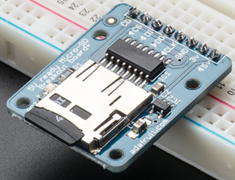
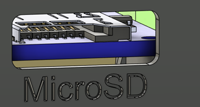

# MicroSD card

SD cards are used in some devices, such as the [Open Playback Recorder](https://github.com/makersmakingchange/Open-Playback-Recorder), to provide storage for the device, typically for audio files. Sometimes these SD cards are put near the edge of the enclosure so that the user can access the card to view, add, or remove files from it. MMC build typically use the Adafruit MicroSD card breakout board+ to read the MicroSD cards. When properly seated in the reader PCB, the MicroSD card protrudes 2mm beyond the end of the reader PCB.

When designing for a user accessible SD card, it is important to keep a knockout area that is large enough for the user to get a finger into the enclosure to remove the SD card, as well as a maximum distance away from the enclosure wall the SD card can be before it is too difficult to remove.

- **Knockout:** The knockout hole in the side of the enclosure, centered on the MicroSD card. This allows the card to pass through the wall of the enclosure. If the hole is too large, debris can enter the enclosure, but if it is too small it is difficult to reach the reader to remove the card.
  - **Width:** The width of the knockout hole in the side of the enclosure.
  - **Height:** The height of the knockout hole in the side of the enclosure.
- **Maximum Card Depth:** The maximum distance from the end of the card when installed, to the exterior edge of the wall of the device. This ensures that the user can still reach in through the gap with their fingertip and press on the card to eject and release it.

| MicroSD Card Measurements |     |
| :--------------------- | -----: | 
| Knockout Size (width x height) | 15 x 5 mm |
| Maximum Card Depth | 2 mm |