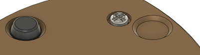

## Non-Slip Feet

Adhesive nonslip feet are used on the bottom of devices to prevent them from sliding around while in use.

The two primary considerations when designing for a non-slip foot are the diameter of the indent that it fits in, as well as the maximum depth.

- **Minimum Diameter:** The minimum diameter that the indent can be while still accommodating most common nonslip foot sizes. In the below image, the minimum diameter is measured at the bottom of the hole, and the chamfer expands from there.
- **Maximum Depth:** The deepest an indent can be while still allowing enough of the foot to protrude to contact the surface the device is resting on to be non-stick.

| Non-Slip Foot Measurements |     |
| :--------------------- | -----: | 
| Minimum Diameter | 12.5 mm |
| Maximum Depth | 3 mm |

The foot linked was chosen since it can be bought individually on Digikey when ordering the other electronic parts of the project. Non-slip feet can also commonly be bought at dollar stores and other similar places. The lack of consistency with diameter and height makes it difficult to consistently design around, but a common diameter is a half inch. If the foot is larger than that, it would be better to leave the surface flat to allow the maker to place them in the best location for that size foot.

## Purchasing

 | **Non Slip Feet can be found at these links:** |        |
| :--------------------- | -----: | 
| Digikey     | [Non-Slip Foot DigiKey Link](https://www.digikey.ca/en/products/detail/bumper-specialties-inc/BS34CL12X25RP/13213600) |
