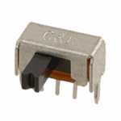
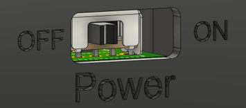
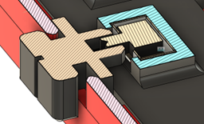
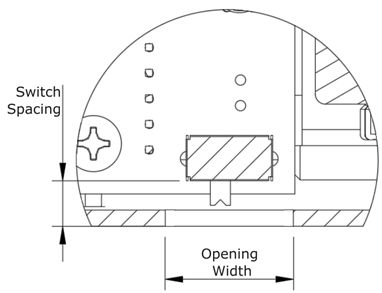

## Slide Switch

A slide switch is a two-state toggle switch used in the [Cedar Joystick](https://github.com/makersmakingchange/Cedar-Mini-USB-Joystick) and the [Open Playback Recorder.](https://github.com/makersmakingchange/Open-Playback-Recorder) Frequently used as a power switch or to toggle between two states, the switch is mounted near the side of the enclosure where it is accessible to the user. The switch can be used by itself, or with a 3D printed toggle switch cover.

A slide switch used by itself, like in the Open Playback Recorder, has a different set of requirements than one used with a 3D printed toggle, like in the Cedar Joystick. With the 3D printed toggle, the 3D printed portion can be adjusted to fit the location of the toggle, so there are fewer limitations.

When using the switch without a toggle, the primary considerations are how close it is to the enclosure wall, and the size of cutout used. If the switch is too close to the wall, the protruding tab makes it difficult to insert the PCB into the enclosure, and if it is too far from the enclosure, it is too hard for the users finger to reach the tab to toggle the switch. The compromise between these two factors found for the Open Playback Recorder was a distance of 5 mm between the outer wall of the enclosure and the edge of the body of the switch, and a cutout 12 mm wide and 5 mm tall.

- **Switch Spacing:** The distance between the body of the switch and the exterior wall of the device.
- **Opening Width:** The width of the opening to the switch toggle.
- **Opening Height:** The height of the opening to the switch toggle.

When designing a version that uses the toggle, the considerations are largely the same as when using the switch without the toggle, the measurements are just slightly different. The main different is that the opening should be split between the two halves of the enclosure, so that the toggle can be captured in place by the closing of the enclosure.

| **Slide Toggle Dimensions** |     |
| :--------------------- | -----: | 
| Switch Spacing | 5 mm |
| Opening (width x height) | 12 mm x 5 mm |
| **3D Printed Toggle Dimensions** |     |
| Switch Spacing | 6.7 mm |
| Opening (width x height) | 10 mm x 5 mm |

## Purchasing

 | **Slide Switches can be found at these links:** |        |
| :--------------------- | -----: | 
| Digikey     | [Slide Switch DigiKey Link](https://www.digikey.ca/en/products/detail/c-k/OS102011MA1QS1/1981431) |
| Mouser | [Slide Switch Mouser Link](https://www.mouser.ca/ProductDetail/CK/0S102011MA1QS1?qs=CScMml99RXNA53k9Q8MdKA%3D%3D)  |
