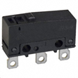
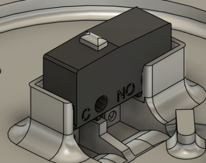

## Snap Switch

This switch is used in the Interact Switch and has holes in the contacts of the switch to allow the cable to be threaded through to make soldering easier.

For this part, there are several primary dimensions used to create a well-fitting press fit retainer. The primary dimensions are:

- **Press Fit Length:** The length of the press fit rectangle that fits the switch
- **Press Fit Width:** Not pictured in the below cross-sectional diagram, it is the width of the press fit rectangle that fits the switch.
- **Press Fit Depth:** The minimum depth from the top of the walls of the retaining wall to the bottom of the switch.
- **Minimum Contact Clearance:** The minimum required distance for the space between the bottom of the switch seat and the bottom of the switch. This gives space for the contacts of the switch to sit. The switch contacts are only 4mm, but extra space is needed to give space for solder if the switch is not soldered well.

| Snap Switch Press Fit Measurements |     |
| :--------------------- | -----: | 
| Press fit length | 20.2 mm |
| Press fit width | 6.4 mm |
| Press fit depth | 7 mm |
| Minimum Contact Clearance | 5 mm |

## Purchasing

 | **Snap Switches can be found at these links:** |        |
| :--------------------- | -----: | 
| Digikey     | [Snap Switch DigiKey Link](https://www.digikey.ca/en/products/detail/omron-electronics-inc-emc-div/SS-3GP/664724) |
| Mouser |  [Snap Switch Mouser Link](https://www.mouser.ca/ProductDetail/Omron-Electronics/SS-3GPB?qs=Rh%252BaoYk36r7SbQm8UayvHw%3D%3D)  |
