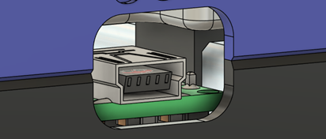
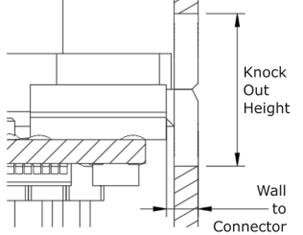
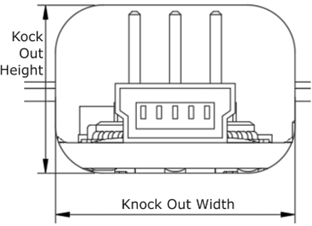
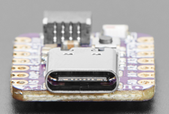
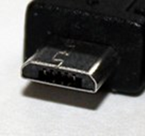
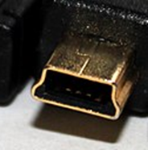

## USB Connector

A USB connector is commonly used to power a microcontroller in a device, or to connect the microcontroller to another device so that it can send data.

When designing with a USB connector, there are three primary considerations, the size of the knockout, the distance from the end of the connector to the exterior of the wall, and the keep out size for the cable.

- **Knock Out:** The knockout spacing is the size of opening needed in the wall of the enclosure for the USB connector on the board to be exposed. In some cases, it is impossible to meet the correct minimum distance from the exterior of the wall to the end of the connector due to how far the connector sticks out (or doesn't) from the end of the microcontroller. In this case, use the keep out spacing as the knockout spacing.
- **Wall to Connector:** The wall to connector distance is the maximum distance between the end of the connector and the outer wall of the enclosure. This gap is the distance between the connector and the molded plastic part of the USB cable when the cable is plugged into the connector.
- **Keep Out:** The keep out area is not a modeled feature and is not on the labeled drawing, but is the maximum size of the molded plastic section of the connector cable. The keep out section of two connectors should never overlap, otherwise both cannot be plugged in at the same time.

### USB C

USB C is the connector found on many modern microcontrollers, such as the QT Pi and other commonly used MMC microcontrollers.

| USB C Measurements |     |
| :--------------------- | -----: | 
| Knock out (width x height) \[mm\] | 10 x 4 mm |
| Wall to Connector \[mm\] | 2 mm |
| Keep out (width x height)\[mm\] | 12 x 6 mm |

### Micro USB

A Micro USB is the connector found on some older microcontrollers.

| Micro USB Measurements |     |
| :--------------------- | -----: | 
| Knock out (width x height) \[mm\] | 7 x 2.6 mm |
| Wall to Connector \[mm\] | 1.9 mm |
| Keep out (width x height)\[mm\] | 12 x 8 mm |

### USB Mini B

| Mini B Measurements |     |
| :--------------------- | -----: | 
| Knock out (width x height) \[mm\] | 7 x 3.4 mm |
| Wall to Connector \[mm\] | 1.6 mm |
| Keep out (width x height)\[mm\] | 10 x 8 mm |

