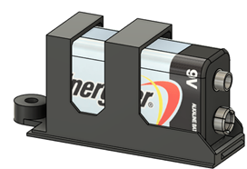

# Battery Covers

When using a 9V battery, it is important to have the battery accessible to the user, but still protected, secure, and out of the way. In the Open Playback recorder, this is done with a battery cover similar to what you would find in a television remote.

The battery is inserted into the battery cover and held in place by friction and later by the fit between the battery terminal connector and the wall of the enclosure. The battery is passed through the hole in the enclosure, then the tab is inserted into the matching groove in the enclosure. Finally, the battery cover is pivoted closed around the tab, and a single screw is used to fasten it in place.

The primary goals of the battery cover were to secure the battery, and keep it easily accessible for the user when it needs to be swapped. Currently, the cover is printed without supports, and the width of the battery cover at the top is starting to sag and deform when bridging. It is possible to reduce the number of fasteners used by printing it on its side and redesign it to have a snap fit fastener as found on the battery enclosure of a television remote. In the current orientation, the layer lines would be more likely to snap, whereas if it was printed on its side the layer lines would be in a stronger orientation.

For detailed measurements, refer to the CAD design files for the Open Playback Recorder, found [here](https://github.com/makersmakingchange/Open-Playback-Recorder/tree/main/Design_Files/CAD_Design_Files).
