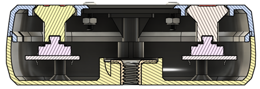
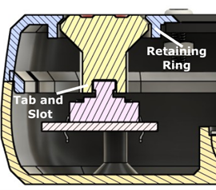
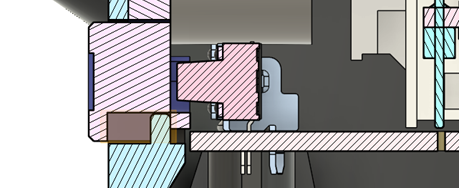
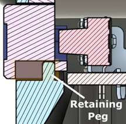
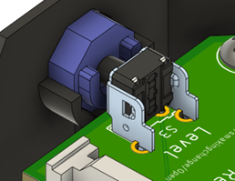
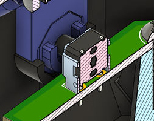

# Captured Buttons

Captured buttons are a 3D printed button component that goes between the actual button component that is inside the device, and the outside of the enclosure. They allow for the button to be located deeper within the device, not directly on the edge, and also allow for symbols or labels to be put on the button to make it more intuitive for a user. They come in two styles, one where the button is facing up out the top of the device (Vertical) and where the button is facing the side of the device (Horizontal).

If you are putting a symbol or other marking on a captured button, make sure to add a locating feature to prevent the button from being inserted in the wrong direction.

## Vertical

When the buttons are facing ‘up’ in an enclosure, the captured buttons can often be simply placed over the electrical buttons, then the top of the enclosure attached into place to lock them in place. The important considerations for designing this type of captured button are the height of the captured piece, button retainment, and button alignment.

If the 3D printed component is too long, it can lead to the button constantly being stuck in the pressed position or frequently sticking when pressed. It is important to have a gap of 0.4 to 0.8 millimeters to ensure that the buttons do not stick but are at the same time not too loose.

For the buttons to be properly captured, they need some form of retainment to keep them captured by the top half of the enclosure and not falling out the top of the enclosure. This is typically accomplished by a heavy chamfer on both the top of the enclosure and the button itself so that the surface of the button is exposed, but it cannot move past the top of the enclosure.

Finally, the button needs to be restrained from moving side to side inside the enclosure. For most buttons used in MMC devices, there is a tab on the top of the button, and a matching detent in the 3D printed captured button will hold one end of the button in place. A retaining ring on the inside surface of the top enclosure is sufficient for holding the other end of the button in place. Finally, if the captured button has a symbol or other design that needs to be in a certain orientation, place a orientation tab or other feature on the captured button and top enclosure to ensure it can only be assembled in that one direction.

## Horizontal

When the switches are facing the side of the enclosure, it is slightly more difficult to design a captive button element. The same constraints apply, the button needs to be close enough to the electrical button, the button needs to be constrained side to side, the button needs to be restrained from falling out of the enclosure, and the button needs to be constrained from rotating. However, when the button is horizontal, it is more difficult to implement these constraints.

The only device in the MMC library that currently uses this style of button is the Open Playback Recorder. In the Open Playback recorder, the button is constrained side to side by the top and bottom of the enclosure, and both oriented/constrained from rotating and kept in the enclosure by a peg in the bottom enclosure that fits into a slot in the captured button. The peg is not the ideal method of capturing the button, as it can snap off and is a point of failure. The chamfered edge method used on the LipSync Hub buttons is less likely to fail, and the button is already prevented from rotating due to its octagonal shape.

The orientation of the button is also ensured by the horseshoe shaped ring. If the button is not in the correct orientation, the circuit board with the buttons soldered to it cannot be inserted into place, hitting the walls of the button instead of sliding into the channel. Finally, the button is octagonal since it has to pass through a horizontal hole in the wall of the enclosure. A round hole would have sagged slightly at the top due to the greater than 45 degree overhang, and required a looser tolerance on the button to compensate for. An octagonal hole and button allow for a tighter tolerance and a better fit between the button and the enclosure.

