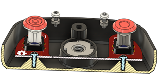
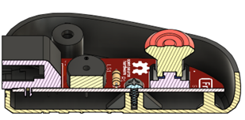
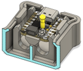
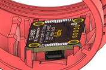
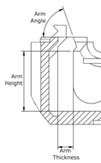

# Capturing a PCB

When attaching a PCB to a 3D printed enclosure, there are two general methods that are used. The first method used is screw, where a PCB is attached to the enclosure with one or more screws, generally a #4 3/8” sheet metal screw. The second method is to design the enclosure with a snap fit that allows the PCB to be pressed and fixed into place.

## Screws

When attaching a PCB using screws, one or more screws are used to attach the PCB to the enclosure. The design specifics for the screws can be found in the #4 Sheet Metal Screw entry in the commercial parts section, while the design specifics for the screw posts can be found in the Screw Posts entry in the 3D printed parts section.

When determining the number and location of the screws, consider the forces that will be acting on the PCB. The PCB will generally be ‘floating’ above the enclosure to make room for the screw posts, and will need to be braced to keep it in place, but not all of the bracing needs to come from the screws. The screws can be used to prevent the PCB from lifting and from sliding side to side, but additional solid posts without screws can be used to prevent the board from tilting or deflecting down when a button is pressed, as seen in the above photo of the LipSync Hub.

## Snap Fit

A snap fit is a method of attaching a circuit board, usually a smaller board like a microcontroller or sensor, without requiring additional hardware. With a snap fit, there are two or more posts with hook-like protrusions at the top, which deflect as the board is pressed into place, and then snap back to their original position once the board has been fully inserted, preventing the board from coming back out. Snap fits can also be used to attach two halves of an enclosure together. The [Ivy Joystick](https://github.com/makersmakingchange/Ivy-Nunchuck-Joystick-Adapter) makes use of snap fits for both retaining PCBs and attaching the enclosure.

 

The snap fit posts stop the board from pulling up and from moving side to side, but additional retaining posts will be needed to keep it from moving side to side in the direction that the posts are not in. The board will also generally be above the enclosure and will need posts or ribs to rest on.

The primary consideration for a snap fit is the length of the deflecting arm, and the layer line orientation of the arm. While it is ideal to orient the arm so that the arms of the snap fit are parallel to the build plate, it is possible to print them perpendicular to the print plate and this frequently has to happen given the orientation of the enclosure and the circuit board. When designing a snap fit, the three main considerations are:

- **Arm Thickness:** The thickness of the snap fit arm. This varies with the height of the arm. Generally a quarter of the height, although making it less than that makes the snap fit less stiff if it snaps while assembling.
- **Arm Length:** The length of the snap fit arm. Varies depending from 6 mm to 13 mm, depending on the desired positioning of the PCB.
- **Arm Angle:** The angle of the surface that the PCB or other piece pushes against while it is being inserted in the snap fit. 70 degrees is a good minimum angle for this, although others have been used.

