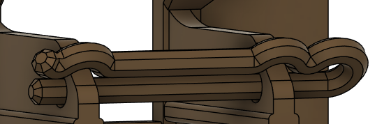
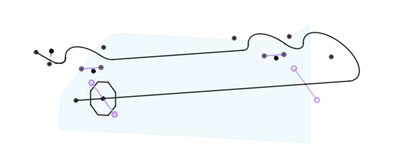
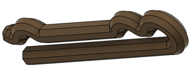

# Cotter Pins

Cotter pins are a method of securing parts, either pinning parts together or to lock them in place after they have been slid into place. They have been used in the [Open Rocker Switch](https://github.com/makersmakingchange/Open-Rocker-Switch) and the [Willow Joystick](https://github.com/makersmakingchange/Willow-Joystick)

When designing a cotter pin, it is made with two primary sketches: the pin profile, and the sweep profile. The pin profile is always an octagon for printability, and the minimum diameter of the circumscribed octagon should be 2 mm, anything smaller than that has difficulty with bed adhesion.

When designing the sweep profile, the end of the pin that does not pass through the holes in the part should be deflected by at least 45 degrees to prevent the wrong side from being inserted into the holes. The side of the pin that does not go through the holes should also have semicircular divots to allow the pin to return to its unstretched shape when it is in place.

If any curves on the sweep profile are too sharp or too close together, the sweep will stop at that point. If that happens, adjust the profile until the sweep can move through the entire profile.
