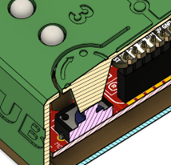
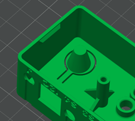

# ‘Lever Arm’ button pusher

The ‘lever arm’ button pusher is used in the Forest Hub and several other devices to create a section of the enclosure that can be used to press internal buttons on a PCB or microcontroller.

The primary considerations when creating the button pusher is print orientation and length of the arm. Since the arm needs to be printed as a cantilever with the layer lines running through it, the only feasible angle to print it on is the bottom print surface, printing directly on the bed. Printing it in any other orientation would require large amounts of support material or will print too weak and will break when used.

The lever section of the arm needs to be long enough to deflect and bend without requiring significantly more force to operate than the button. The lever arm is generally between 2.4 to 6 mm wide, and at least 6 mm long. The end of the lever should have a cone, post, or other protrusion that rests within a millimeter or two of the button on the PCB so that the button is pressed almost immediately after pressing the lever arm.
