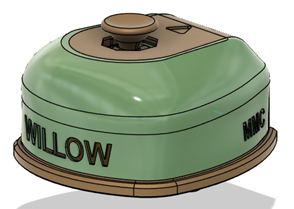
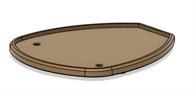
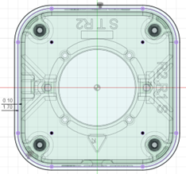
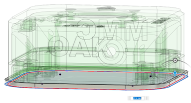
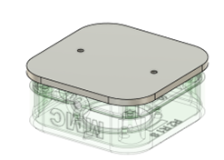

# Non-Slip Base

Some of the OpenAT joysticks, such as the Willow, come with a non-slip base that helps them stay in one place while being used on a table or other flat surface. This base uses the mounting standard used in the camera mount adapter and the Ram-B ball adapter to stay in place, and several non-slip feet to prevent it from moving around on the surface.

To create a non-slip base, create a sketch on the bottommost surface of the device, and project the walls of the device down. Create a clearance offset of 0.1 mm, and a second offset 1.6 mm beyond that. Extrude this ring up, the distance will vary depending on how much of a chamfer there is on the base of the device.

Next, extrude the base down by 2.4 mm, leaving the mounting holes uncovered. Chamfer the interior corner of the base as needed to match the chamfer on the bottom of the device, and chamfer the bottom of the non-slip foot, generally 1.6 mm but this can be changed to keep the thickness more consistent if the chamfer on the bottom of the device is significantly larger or smaller than that.

Once the body of the base has been created, add clearance holes for the M3 screws. Create a 7.5 mm diameter circle around each of the M3 screw holes, then extrude it down by 1.2 mm to create a counterbore. Add the unsupported hole features found [here](https://www.hydraresearch3d.com/design-rules#unsupported-holes).

Finally, find the locations that you would like to put the non-slip feet, then follow the non-slip feet guide found in the commercial parts section.
