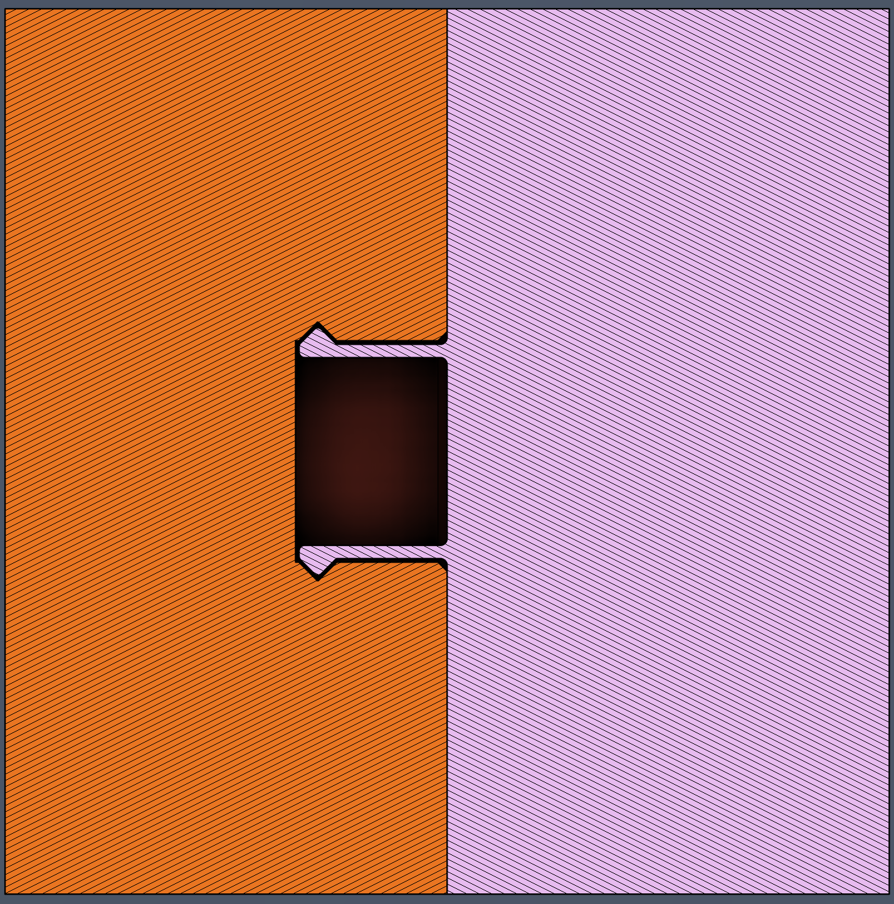
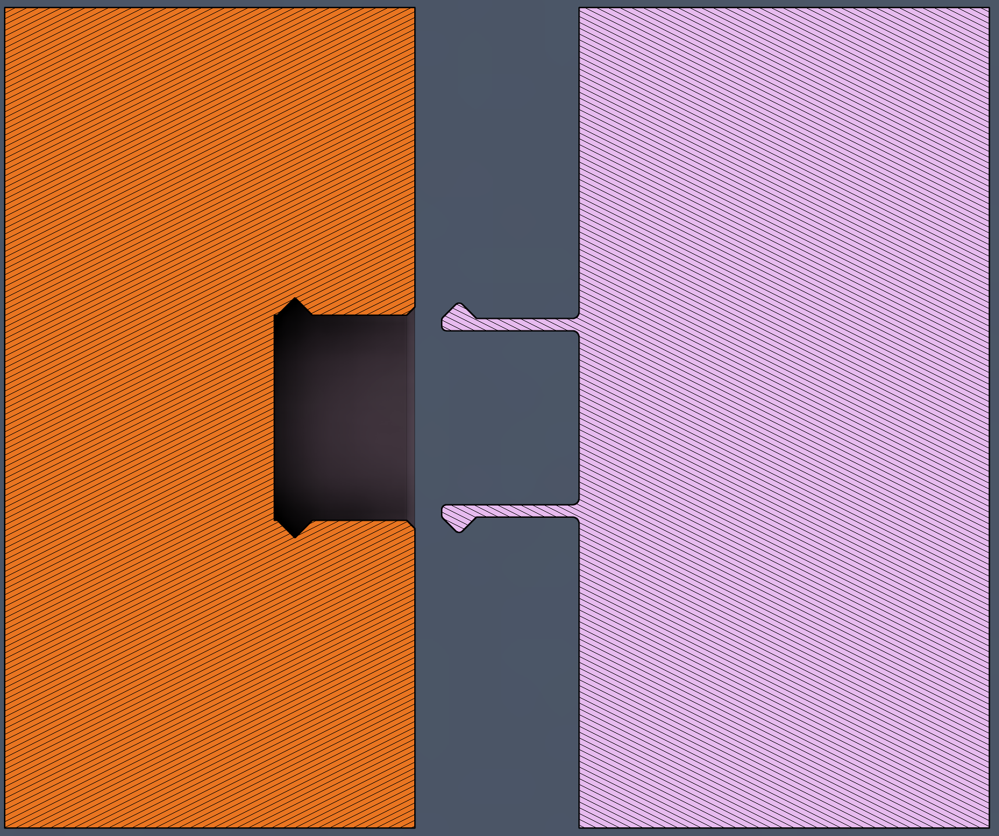
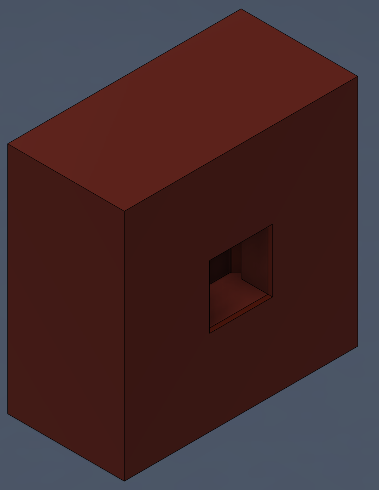
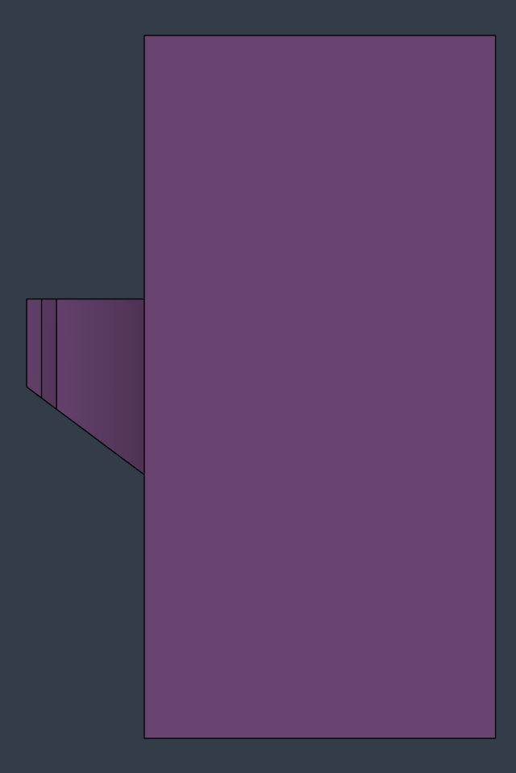
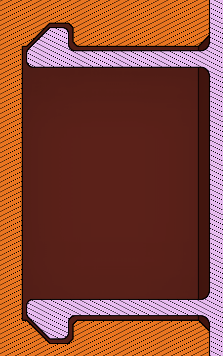
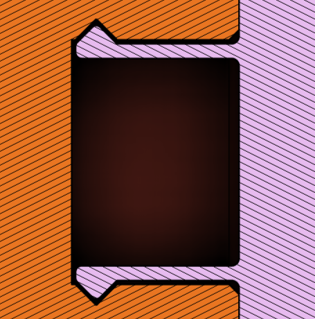

# Snap Fit Connections

Snap fits can be used to connect 3D printed parts in lieu of using other fasteners. These can make assembly/disassembly faster and easier, and reduce the cost of the device. Getting strong and reliable snap fits can be challenging though, and may require multiple iterations to get correct. These snap fit components were based on those described in a [video by Slant 3D.](https://www.youtube.com/watch?v=RTQjvYENR7w) These types of snap fits were first used by Makers Making Change in the [Chatterbox.](https://github.com/makersmakingchange/Chatterbox)

The snap fit consists of an internal recess and the bending fins. The bending fins are shown in the above images as part of the pink part, and bend then lock into position when they reach the cutout in the recess. The above images show a section view of the snap fit to clarify how they connect, but the recess is fully enclosed, as shown in the image below.

## Dimensions

The general dimensions of these snap fits will depend on the requirements of the part, so a detailed list of dimensions will not be provided.
* **Clearance/Tolerance:** The clearance/tolerance between the snap fit fins and the hole they snap into will affect how easily the parts snap together/apart, and how tight the resulting fit is. We found that adding a tolerance/clearance of 0.4 mm provided a good balance between ease of assembly/disassembly and tightness of the fit.

## Design Considerations

There are a few key considerations when designing these types of snap fits that will impact their printability, durability, and ease of use.

* **Print orientation:** You want to make sure the parts are printed so that the layer lines are not in-plane with the tabs. Making the layer lines in-plane with the tabs means that bending load from the tabs flexing is carried across layer lines, which are much weaker and more likely to snap. This also leads to the next consideration.
* **Overhangs:** To avoid printing the tabs in-plane with the layers, the tabs will stick out from the side of a part as it prints. The tabs will either need to come down to the print bed, use support material, or have a slanted overhang. We recommend an overhang angle of 45 degrees or higher (from the horizontal) for these features. Having the tabs touch the build plate reduces flexibility in design, and makes prints more likely to fail due to a complex shape on the first layer.

* **Smooth Edges:** As always, you want to use fillets and chamfers to smooth sharp edges. These make the connections slide together more easily, and strengthen the parts by reducing stress concentrations.
* **Fixed or Removeable Connection:** You will need to decide if you want this connection to be fixed or removeable. To make a more fixed connection, you can make the hook on the tabs with more of a barbed shape, where the angled end can slide in more easily, but the flattened barb on the back makes it more difficult for the parts to pull apart.

To make a snap fit that can be pulled apart more easily, the tab can have an angle on both sides, like in the image below.

* **Tab Length and Width:** The length and width of the tabs will impact the strength, durability, and flexibility of the tabs. Shorter, wider tabs will be stronger and harder to bend, while longer, thinner tabs will be easier to flex and weaker. You may need to test different combinations of tab length and width to get the right balance of stiffness, strength, and durability for your joint.

