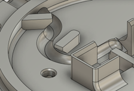
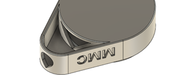

# Strain Relief and Cable Retention

When using cables or wires in your design that pass outside of the enclosure, like the cables on the switches, there is the risk of the cable getting pulled one, putting force on the solder joints or popping the cable out of place. To mitigate this issue, strain relief is used to prevent force on the cable from putting force on the solder joints, and cable retention is used to hold a cable in the channel or spot it is supposed to stay in. Generally, in the devices in the MMC library, this is done with hot glue or a cable tie, but there are some cases where a 3D printed feature is used to accomplish this, such as in the [Interact Switch](https://github.com/makersmakingchange/Interact-Switch).

For a strain relief feature to work, it needs to stop any mechanical force from making it to the electrical connection. The Interact Switch does this with a serpentine half circular channel in the base, with two opposing wedge-shaped overhangs that prevent the cable from rising out of the channel when pushed or pulled. These overhangs also work as cable retention, stopping the cable from leaving the channel.

If using hot glue for strain relief, like in the Raindrop Switch, add a channel or other recess that the cable passes through that can be filled with hot glue to secure the cable in place, both retaining the cable and preventing the force from making it to the joint. Hot glue is not recommended as a method of strain relief, as the heat can deform the 3D printed parts, and the glue makes it very difficult to disassemble the device for future repairs.

If using a cable tie for strain relief, refer to the cable tie entry in the commercial parts section for information about designing cable ties into devices.
