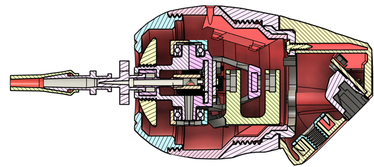
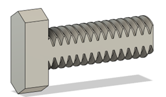
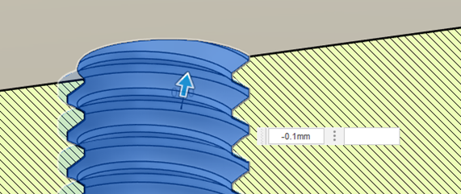
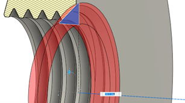
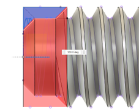

# Threads

When designing parts, 3D printed threads can be used to fasten together parts without requiring the maker to purchase additional hardware. However, there are considerations that limit the use of 3D printed threads to specific use cases.

The first consideration is print orientation. Due to overhang limitations, threads can either be printed on their side, or vertically. Attempting to print a thread on an angle will not work. Printing a thread on its side creates a stronger thread, as the layer lines will not be under tension as in a vertical orientation. However, one side needs to be trimmed to create a print surface, and it is difficult to do when the thread is on anything other than a bolt. Vertical printing is commonly used when on an enclosure or other part, such as in the LipSync. The layer orientation is less of an issue in larger diameter threads when the surface area in each layer is larger.

When printing on their side, trim one side of the thread to provide a surface for the print. Trimming a quarter of the diameter off one side generally provides a good-sized build surface without degrading the quality of the bolt.

When modeling threads for printing, it is important to add a clearance between the male and female threads to allow for the tolerances of the 3D printer and ensure an easy fit between threads. After modeling both the male and female threads with the same thread size, select the faces of the female thread with the offset tool, and offset them inwards by 0.1 mm.

When deciding which thread size to use, it is important to consider the minimum possible thread size that a 3D printer can make. Anything smaller than an M5 thread is difficult to print, and will likely fit poorly, if it fits at all.

Finally, to make it easier to begin threading 3D printed parts together, the beginning parts of the male and female threads can be manually chamfered to make starting the threads easier. Because of the threads spiraling, the chamfer tool cannot be used for this. Instead, create a triangle in the shape of the desired chamfer at the midplane of the thread, and revolve it around the center axis to cut the chamfer. When doing this to the male section of the threads, the threads can be trimmed off the first several millimeters of the thread to create a dog point to make inserting the screw easier.

 