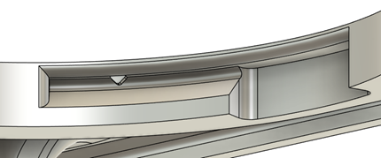
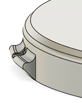

# Twist Lock

A twist lock allows a piece, such as a button topper, to be pressed into place then rotated and locked into position. This allows for parts to be installed with minimal force without using fasteners. This design element is used in the [Open Rocker Switch](https://github.com/makersmakingchange/Open-Rocker-Switch) and [Willow Joystick](https://github.com/makersmakingchange/Willow-Joystick).

There are two components to the twist lock, the tab and the slot. The tab is the section that protrudes from the component that locks in place, and the slot is the section in the main part that the tab rides in. There are typically two to four tabs on a part.

The dimensions and key considerations for tabs and slots

- **Minimum Size:** The minimum size for the tab is driven by the minimum size for the retaining bump. The tab should be at least 3mm wide, and 1.2mm tall, but larger than this is better.
- **Overhangs:** Depending on the print orientation, the tab and slot may need to have one or more surfaces printed on a 45 degree angle to print without sagging.

The final consideration when designing a twist lock mechanism is the locking bump. There is a bump located on the slot of the part, which locks into a corresponding divot in the tab. When the tab is nearly fully rotated in the part, it comes into contact with the bump. The part with the tab can then be forced past the bump until it is fully seated and the bump is resting in the divot in the tab. At this point the part is fully installed and will not come loose until twisted with equal force past the bump.

Dimensions and key considerations for bump and divot are as follows:

- **Bump Placement:** The bumps can either be placed on the top of the tab and slot, as seen in the above images, or on the sides. Putting the bump on the side is the better placement, as this usually printed parallel to the build plate, and lasts longer against repeated removals and insertions.
- **Minimum and Maximum Size:** The sizing of the bumps can be difficult, as they need to allow the tab to pass through, but still retain it once it is in place. The best size varies with the flexibility of the parts being connected together, but 0.4-1 mm is a good starting range.

If using the bump and divot, it is important to note that makers will need to twist the part until they lock in place. Otherwise, makers may assume they have properly assembled the parts once they twist and meet the resistance of the edge of the tab with the divot meeting the bump. If they do not lock the bump into the divot, the parts will easily twist apart.
